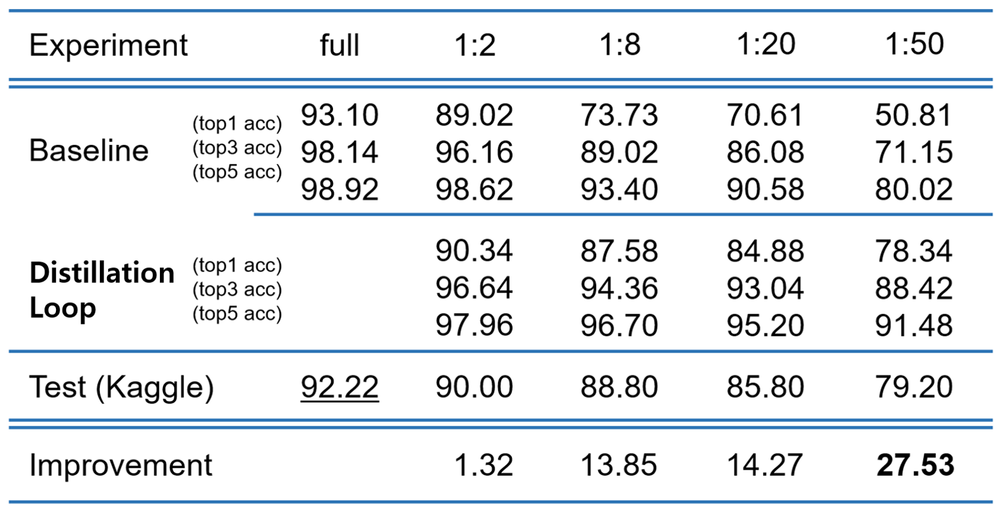

# POSTECH CSED538 Group12 Deep Learning Project

## Semi-supervised Image Classification with Distillation Loop
>>Deep learning has recently achieved state-of-the-art performance in many computer vision tasks. One of the key driving force of deep learning success is large labeled data sets, demanding additional effort for labeling. 
However, there are still lots of unlabeled data that can help improving performance. In this manner, semi-supervised learning(SSL) can utilize partially labeled (composed of both full labeled and unlabeled) data. Here, we present simple, but effective method of semi-sup learning by **‘distillation loop’**.

## performance on DL20 dataset

### Preparation
First of all, I highly recommend you to use "virtualenv" or "anaconda" for managing python libraries in Ubuntu/Mac.

After making your own private python environment, Please install needed python packages

>  pip install -r requirements.txt

You have to install proper pytorch package with your own gpu; 

### Dataset
#### We use DL20, which has 20 classes.
You have to make following dataset hierarchy:

---

dataset / DL20 / [train, valid, test]

---

train - [0, 1, 2, ... , 19]

valid - [0, 1, 2, ..., 19]

test - images without label

---
### Dataset split for making unlabeled dataset list 
> python3 split.py

dataset / DL20 / [0.1_label_path_list.txt, 0.1_unlabel_path_list.txt, ... ],

or you can use label-unlabel split path record directly from our github repo.

---
### For fully supervised baseline training

> python3 main_baseline.py --ratio=1.0 

---

### For Semi-sup learning

you can choose label : unlabel ratio = [0.5, 0.125, 0.05, 0.02]

#### Stage-1 training : mean-teacher

> python3 main.py --ratio=0.02 --exp-name="1_50_base"

#### Stage-2 training : distillation loop

> python3 main.py --ratio=0.02 --pretrained-ckpt="./checkpoints/1_50_base/best.pth" --exp-name="1_50_FINAL" --second-stage=True

---
### For validation & kaggle submission

> python3 test.py --pretrained-ckpt="./checkpoints/1_50_FINAL/best.pth" --exp-name="1_50_FINAL"

### Final weights for label : unlabel = 1:50

https://drive.google.com/file/d/1Ln2PAfUadq6iPrbbobe5DoTBHkqYbBft/view?usp=sharing

### Basic information about framework
#### backbone : efficientnet-b04 

### Contributors
권동현 20212423 

감제원 20202637    

이주용 20160271
